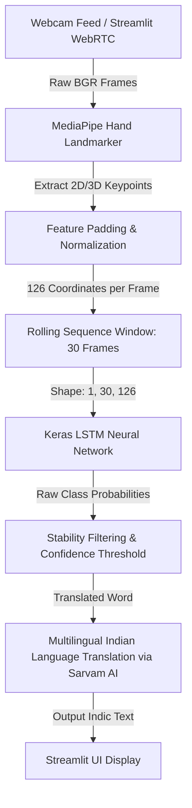
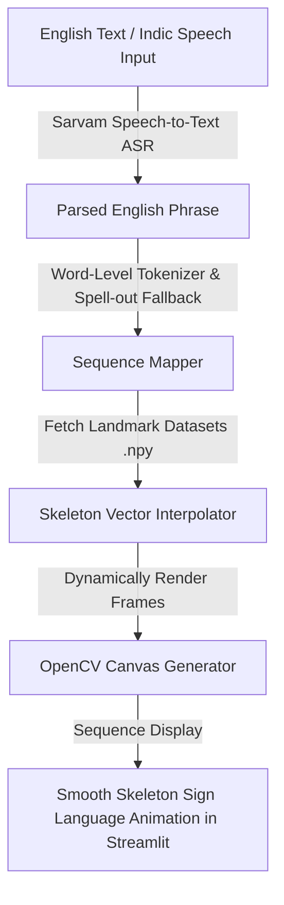

# 🤟 GestureBridge: Indian Sign Language Translation & Synthesis Suite

GestureBridge is an, deep-learning-powered translation and synthesis framework for Indian Sign Language (ISL). Combining **MediaPipe** for high-fidelity hand landmarking, **TensorFlow/Keras** for sequence classification, **Streamlit** for real-time web interface, and **Sarvam AI** for multilingual Indic translation and speech-to-text (STT), GestureBridge bridges the communication gap between hearing-impaired individuals and the rest of the world.

---

## 🏗️ Architectural Overview & Data Flow

GestureBridge works in two primary directions: **Sign-to-Text Translation** (Inference) and **Text-to-Sign Synthesis** (Animation).

### 1. Sign-to-Text Data Flow (Inference Pipeline)


### 2. Text-to-Sign Data Flow (Synthesis Pipeline)


---

## ✨ Key Features

*   **Real-Time ISL-to-Text Translation**: Stream live video from your webcam via WebRTC. The system captures landmarks, translates them instantly, and displays translated sentences.
*   **Stability & Confidence Filtering**: Employs a robust rolling prediction window filter (requiring consistent high-confidence outputs across 10 frames) to eliminate flickering and erratic predictions.
*   **Text-to-Sign Synthesis**: Input any word or sentence, and watch the system dynamically compile and render a fluid hand skeleton animation in real time.
*   **Voice-Activated Synthesis**: Leverage the power of **Sarvam AI's ASR** to speak in your native Indic language, transcribe it, translate it, and animate it.
*   **Indic Translation Suite**: Directly translate recognized sign-language concepts into multiple regional Indian languages via **Sarvam AI's Translation API**.
*   **Custom Sign Recorder & Dataset Builder**: Easily record custom gestures (30 frames per gesture) with real-time feedback to expand the ISL lexicon.
*   **Local Training Suite**: A lightweight, standalone LSTM model training pipeline that parses recorded NumPy coordinates and generates optimized `.keras` weights in minutes.

---

## 📁 Repository Directory Layout

```bash
├── .github/                 # GitHub workflows and instructions
├── refs/                    # Reference architectural diagrams & project briefs
│   ├── class_diagram.png    # Core class inheritance and structure
│   ├── use_case.png         # User interaction paths
│   └── project_explanation.md # Complete design breakdown
├── GestureBridge/           # Main Application Package
│   ├── app.py               # Streamlit Multi-Page Web Frontend (Inference, Recording, Synthesis)
│   ├── hand_tracking.py     # MediaPipe hand tracking & coordinate normalization
│   ├── text_to_sign.py      # Text parser, spelling fallback & skeleton frame renderer
│   ├── model.py             # LSTM Neural Network architectural definition
│   ├── train.py             # Local model training and preprocessing script
│   ├── data_collection.py   # Dataset capturing and Numpy serialization helper
│   ├── sarvam_utils.py      # API Client integration with Sarvam AI REST endpoints
│   ├── action.keras         # Trained Keras sequence classifier model weights
│   ├── hand_landmarker.task # MediaPipe pre-trained model file
│   └── requirements.txt     # Sub-project Python dependencies
├── pyproject.toml           # Root workspace configuration (uv support)
├── uv.lock                  # UV environment lockfile
└── README.md                # Project documentation
```

---

## 🚀 Installation & Environment Setup

GestureBridge is configured as a modern workspace. We recommend using **`uv`** (an extremely fast Python package and environment manager) or standard **`pip` + `venv`**.

> [!NOTE]
> Ensure you are using **Python 3.10** or higher.

### Method 1: Using `uv` (Recommended)

1. **Clone the Repository**:
   ```bash
   git clone https://github.com/yourusername/GestureBridge.git
   cd GestureBridge
   ```

2. **Initialize Virtual Environment & Install Dependencies**:
   ```bash
   uv venv
   # On Windows:
   .venv\Scripts\activate
   # On macOS/Linux:
   source .venv/bin/activate

   uv pip install -r GestureBridge/requirements.txt
   ```

### Method 2: Standard `pip` and Virtualenv

1. **Clone the Repository**:
   ```bash
   git clone https://github.com/yourusername/GestureBridge.git
   cd GestureBridge
   ```

2. **Create & Activate a Virtual Environment**:
   ```bash
   python -m venv venv
   # On Windows:
   venv\Scripts\activate
   # On macOS/Linux:
   source venv/bin/activate
   ```

3. **Install Core Dependencies**:
   ```bash
   pip install --upgrade pip
   pip install -r GestureBridge/requirements.txt
   ```

---

## 🔑 Configuration & API Keys

GestureBridge integrates with **Sarvam AI** for high-quality Indian language speech-to-text and translation. 

1. Create a file named `.env` in the `GestureBridge` directory:
   ```bash
   touch GestureBridge/.env
   ```

2. Open the file and add your **Sarvam AI API Key**:
   ```ini
   SARVAM_API_KEY=your_sarvam_api_key_here
   ```

> [!IMPORTANT]
> The `.env` file is explicitly included in our root `.gitignore` to prevent you from accidentally committing your private API keys to GitHub!

---

## 💻 Operation Guide

To start the Streamlit application, run the following command from the root of the project:

```bash
streamlit run GestureBridge/app.py
```

### 1. Live Sign Translation (`Sign → Text` Tab)
- Turn on your webcam within the UI.
- Position yourself in front of the camera, showing your hands.
- Perform a recorded sign gesture continuously (the model processes sequences in rolling groups of **30 frames**).
- Once a gesture is recognized with confidence $> 0.5$ consistently for 10 frames, it will be added to the output translation screen.
- Choose your preferred regional language (e.g., Hindi, Tamil, Telugu) to translate the recognized text in real time using Sarvam AI.

### 2. Custom Gesture Recording (`Add Signs` Tab)
- Enter the name of the new sign you want to teach the system (e.g., `"WELCOME"`).
- Select the number of sequence examples to record (we recommend at least 10–20 sequences per sign).
- Click **Start Recording** and perform the gesture. The app will capture 30 frames for each sequence, extracting hand coordinates and saving them locally as Numpy arrays under `GestureBridge/MP_Data/`.

### 3. Model Training Suite (`Train Model` Tab)
- Once you have recorded enough sequences, navigate to this tab (or run `python GestureBridge/train.py` from your terminal).
- Click **Train** to preprocess your coordinate data, label encode the folders, compile the LSTM architecture, and train your model.
- Upon completion, the new weights are saved directly to `GestureBridge/action.keras` and loaded automatically for live translation!

### 4. Animation Synthesis (`Text → Sign` Tab)
- Input an English word, phrase, or sentence, or use the **Voice Input** button to speak in an Indic language (e.g., Hindi, Bengali).
- If Voice is used, Sarvam AI transcribes and translates it into English.
- The system will parse the phrase into tokenized units. If a word is unknown, it falls back to spelling it letter-by-letter.
- Watch as the system renders the coordinate sequence frame-by-frame on a blank digital canvas, translating words into smooth, physical animations.

---

## 📊 Neural Network Architecture

The sequence classification engine uses a customized **LSTM (Long Short-Term Memory)** network optimized for time-series skeleton landmarks:

```
_________________________________________________________________
 Layer (type)                Output Shape              Param #   
=================================================================
 lstm (LSTM)                 (None, 30, 64)            48,896    
 lstm_1 (LSTM)               (None, 128)               98,816    
 dense (Dense)               (None, 64)                8,256     
 dense_1 (Dense)             (None, <Num of Classes>)  650       
=================================================================
```
- **Input Dimension**: `(30, 126)` — representing 30 frames, each containing 126 coordinate features (21 landmarks × 3 dimensions `[x,y,z]` × 2 hands).
- **Temporal Modeling**: Stacked LSTM layers capture dynamic movement over time rather than simple static postures.

---

## 🤝 Contribution & License

Contributions to support more gestures, Indic dialects, or 3D avatar rendering are highly encouraged! Feel free to open issues or submit pull requests.

*This project is distributed under the MIT License.*
